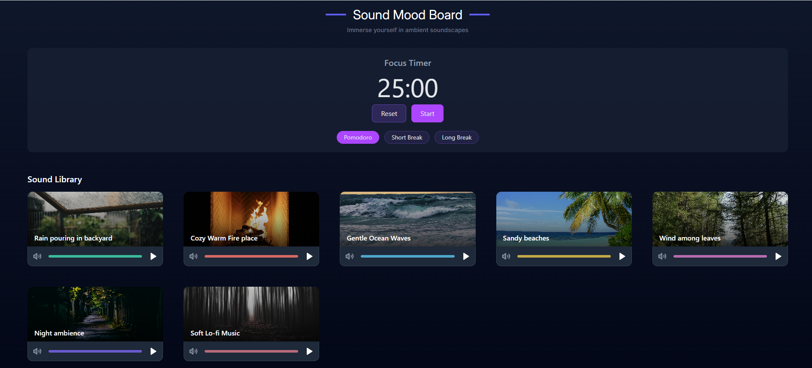

# Sound Mood Board

Sound Mood Board 🎵🧘‍♂️ is a web app designed to enhance focus, relaxation, and creativity by immersing users in ambient soundscapes. It combines a customizable sound library with a built-in Pomodoro timer to create the perfect environment for deep work, study, or meditation.



### Features
🎶 Sound Library: Mix and match soothing sounds like
⏱️ Focus Timer: Stay productive with a Pomodoro-style timer with focus and break sessions
🎚️ Volume Control: Individually adjust the volume for each sound to create your ideal mix.
🌙 Modern UI: Clean, dark-themed interface for minimal distractions and comfortable long-term use.

### Technologies Used - 
React.js + Tailwind

### How to Use
1. Pick your favorite ambient sounds and adjust the volume to your preference.
2. Set the timer by selecting "Pomodoro", "Short Break", or "Long Break".
3. Press Start to begin your focus session.
4. Enjoy the immersive environment and stay productive!


## Getting Started

### Prerequisites

Make sure you have Node.js and npm installed on your machine. If not, follow the instructions in the [Node.js Installation](#nodejs) section below.

### Installation

1. Clone the repository:

```bash
git clone https://github.com/P1210/sound-mood-board.git
```

2. Navigate to the project directory:

```bash
cd sound-mood-board
```

3. Install dependencies:

```bash
npm install
```

### Available Scripts

In the project directory, you can run the following commands:

- Start the development server:

```bash
npm run dev
```

This will launch the app in development mode with hot module replacement (HMR). Now you will need to navigate to http://localhost:5173 in the browser to use the application.

- Build for production:

```bash
npm run build
```

Builds the app for production to the dist folder.

- Preview the production build:

```bash
npm run serve
```

This will serve the production build locally for testing.